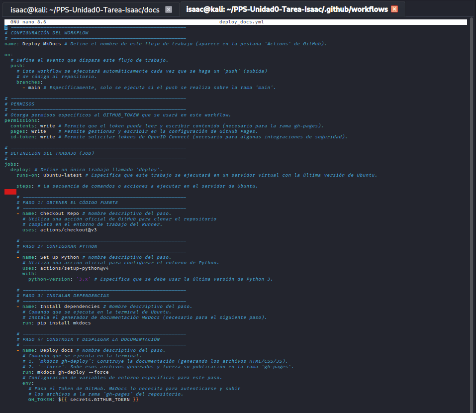
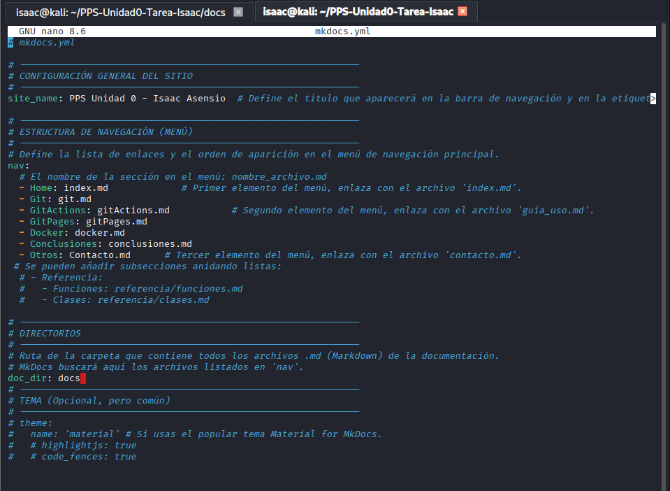

# Documentación del WorkFlow de GitHub Actions

En este documento explico el proceso utilizado para crear el sistema automático de despliegue mediante **GitHub Actions**, encargado de generar y publicar la documentación con MkDocs cada vez que hago un *push* al repositorio.

---

## 1. Creación de la carpeta del WorkFlow

Primero tuve que crear la carpeta donde GitHub busca automáticamente los workflows.
Lo hice desde la terminal dentro del repositorio:

```
mkdir -p .github/workflows

cd .github/worflows

nano deploy_docs.yml

```

---
 
## 2. Modificación del Archivo deploy_docs.yml 

El fichero despliega automáticamente la documentación: tras cada push en main, instala MkDocs y publica la web en la rama gh-pages.



---

## 3. Creación del archivo de Configuracion

En este paso se crea el archivo de configuración `mkdocs.yml`,que es el documento principal que controla cómo se genera la documentación con MkDocs.
Aquí se define el nombre del sitio, el menú de navegación y los archivos Markdown que formarán la estructura de la página. Una vez creado,
edité este archivo para añadir todas las secciones de la documentación y dejar configurada la navegación del proyecto.


---
## 4. Verificación del WorkFlow

Una vez creado y configurado el workflow, realicé un `git add`, `commit` y `push` para activar el proceso:

```
git add .
git commit -m "Activado workflow de documentación"
git push

```


