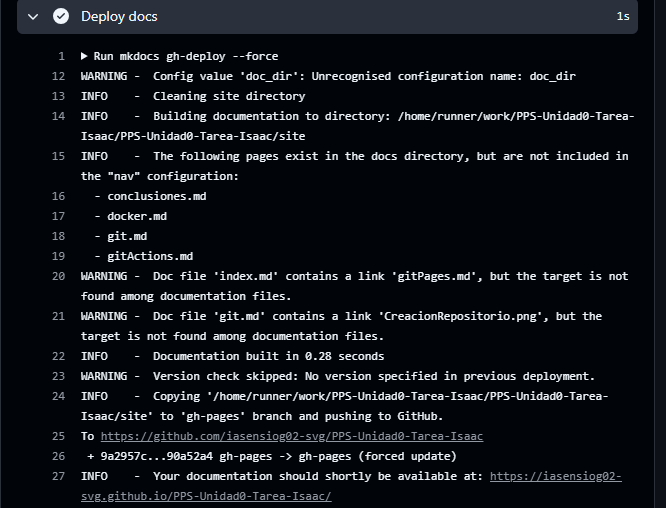

#Documentación del GitHub Pages

En este documento explico el proceso necesario para activar y comprobar la publiación de la documentación mediante **GitHub Pages**, utilizando la rama `gh-pages` generada por el workflows automatico.

---

## 1. Activación del GitHub Pages

Para habilitar Github *pages* accedi a:

**Setings -> Pages**

y se selecciona Brach y se pondra:

**Brach -> gh-pages**

---

## 2. Verificación del Build

Para ver si ha hecho bien el build hay que acceder a tu repositorio y a:

**Action -> Nombre del commit **

Dentro de el aparecerá algo asi que será el build

---

## 3. Ver documentación 
La URL para ver el formato será:

`http://$Usuario_Github.github.io/$Repositorio`

 

